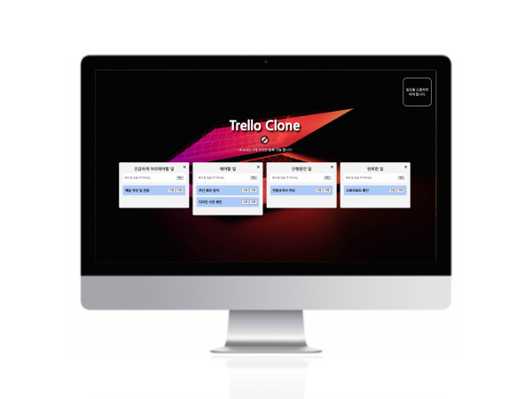
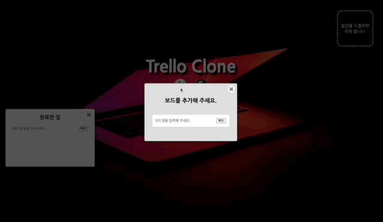
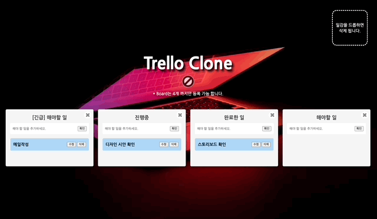
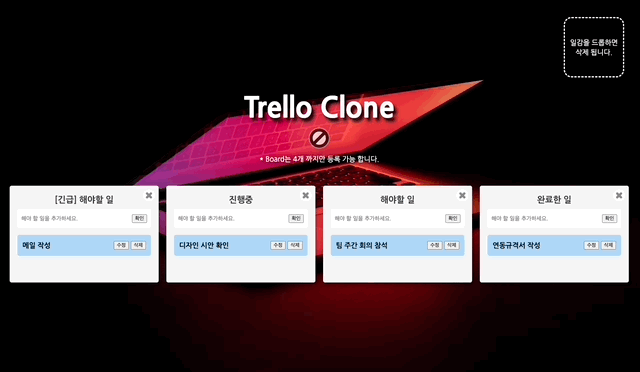

# Trello Clone
 

 
<a display="block" href="#">https://github.com/KimByul1225/trello_clone</a>
  

 

## 화면구성 🖥

 

## Stacks 🧑🏻‍💻
### Environment

### Config
        
### Development
 

![Recoil](https://img.shields.io/badge/recoil-3578e5?style=for-the-badge&logo=data:image/svg+xml;base64,PHN2ZyB4bWxucz0iaHR0cDovL3d3dy53My5vcmcvMjAwMC9zdmciIHdpZHRoPSI2MDAiIGhlaWdodD0iNjAwIiB2aWV3Qm94PSIwIDAgNjAwIDYwMCI+PGxpbmsgeG1sbnM9IiIgdHlwZT0idGV4dC9jc3MiIGlkPSJkYXJrLW1vZGUiIHJlbD0ic3R5bGVzaGVldCIgaHJlZj0iIi8+PGcgZmlsbD0id2hpdGUiPjxwYXRoIGQ9Ik0xNDIuNTM2IDE5OC44NThjMCAyNi4zNi0yMS4zNjggNDcuNzItNDcuNzIgNDcuNzItMjYuMzYgMC00Ny43MjItMjEuMzYtNDcuNzIyLTQ3LjcyczIxLjM2LTQ3LjcyIDQ3LjcyLTQ3LjcyYzI2LjM1NSAwIDQ3LjcyMiAyMS4zNiA0Ny43MjIgNDcuNzIiLz48cGF0aCBkPSJNNTA1LjE4IDQxNC4yMjVIMjM4LjEyNGMtMzUuMjUgMC02My45MjYtMjguNjc0LTYzLjkyNi02My45MjNzMjguNjc4LTYzLjkyNiA2My45MjYtNjMuOTI2aDEyMC43OGMyMC44MTYgMCAzNy43NTMtMTYuOTM4IDM3Ljc1My0zNy43NTZzLTE2LjkzOC0zNy43NTYtMzcuNzUzLTM3Ljc1Nkg5NC44MWMtNy4yMjcgMC0xMy4wODYtNS44Ni0xMy4wODYtMTMuMDg1IDAtNy4yMjcgNS44Ni0xMy4wODYgMTMuMDg1LTEzLjA4NmgyNjQuMDkzYzM1LjI1IDAgNjMuOTIzIDI4LjY3OCA2My45MjMgNjMuOTI2cy0yOC42NzQgNjMuOTIzLTYzLjkyMyA2My45MjNoLTEyMC43OGMtMjAuODIgMC0zNy43NTYgMTYuOTM4LTM3Ljc1NiAzNy43NiAwIDIwLjgxNiAxNi45MzggMzcuNzUzIDM3Ljc1NiAzNy43NTNINTA1LjE4YzcuMjI3IDAgMTMuMDg2IDUuODYgMTMuMDg2IDEzLjA4NSAwIDcuMjI2LTUuODU4IDEzLjA4NS0xMy4wODUgMTMuMDg1eiIvPjxwYXRoIGQ9Ik00NTcuNDY0IDQwMS4xNDJjMC0yNi4zNiAyMS4zNi00Ny43MiA0Ny43Mi00Ny43MnM0Ny43MiAyMS4zNiA0Ny43MiA0Ny43Mi0yMS4zNiA0Ny43Mi00Ny43MiA0Ny43Mi00Ny43Mi0yMS4zNi00Ny43Mi00Ny43MiIvPjwvZz48c3R5bGUgeG1sbnM9IiIgaWQ9ImRhcmstbW9kZS1jdXN0b20tY29sb3IiPgoJCTpyb290ewoJCQktLWJnLWNvbG9yOnJnYmEoMjYsMjYsMjYsMSk7CgkJCS0tdGV4dC1jb2xvcjpyZ2JhKDExMCwxMTAsMTEwLDEpOwoJCQktLWEtY29sb3I6cmdiYSg5MCwxMjAsMTIwLDEpOwoJCQktLWEtdmlzaXRlZC1jb2xvcjpyZ2JhKDEyMCwxMjAsOTAsMSk7CgkJCS0tYS1ob3Zlci1jb2xvcjpyZ2JhKDIxMSwyMTEsMjExLDEpOwoJCQktLWlucHV0LWJvcmRlci1jb2xvcjpyZ2JhKDIxMSwyMTEsMjExLDAuMik7CgkJCS0taW5wdXQtcGxhY2Vob2xkZXItY29sb3I6cmdiYSgxNzMsMjE2LDIzMCwxKTsKCQkJLS1kaWFsb2ctYmctY29sb3I6cmdiYSgzNiwzNiwzNiwwLjk1KTsKCQkJLS1iZy1pbWFnZTpsaW5lYXItZ3JhZGllbnQocmdiYSgyNiwyNiwyNiwxKSxyZ2JhKDI2LDI2LDI2LDEpKTsKCQl9Cgk8L3N0eWxlPjwvc3ZnPg==)
 
![React Beautiful Dnd](https://img.shields.io/badge/react--beautiful--dnd-0baf7c.svg?style=for-the-badge&logo=data:image/png;base64,iVBORw0KGgoAAAANSUhEUgAAAV4AAADwCAYAAABISgwwAAAABGdBTUEAALGPC/xhBQAAAAFzUkdCAK7OHOkAAAAgY0hSTQAAeiYAAICEAAD6AAAAgOgAAHUwAADqYAAAOpgAABdwnLpRPAAAButJREFUeJzt3d1a2zgYhVGnT+//lt0TmGYKJLJsbetnrdNhglHJ6y+KY7YNAAAAAAAAAAAAAEh7lH7hvu97ywOBVT0ej+LnIXMQXmAYs5ykft19AACrEV6AMOEFCBNegDDhBQgTXoCw31c90CyXeQD3WuHSVRMvQJjwAoQJL0CY8AKECS9AmPAChAkvQJjwAoQJL0CY8AKECS9A2GX3agBo7Yr7OPRwXxkTL0CY8AKECS9AmPAChAkvQJjwAoQJL0CY8AKECS9AmPAChAkvQJjwAoQJL0CY8AKECS9AmPAChAkvQJjwAoQJL0CY8AKECS9AmPAChAkvQJjwAoQJL0CY8AKECS9AmPAChAkvQJjwAoQJL0CY8AKECS9AmPAChAkvQJjwAoQJL0CY8AKECS9AmPAChAkvQJjwAoQJL0CY8AKECS9AmPAChAkvQNjvuw+A1/Z931/998fj8Ugdy0qsOy2ZeDv27sn/+TUlX0eZ0vW05pwhvJ06+sQWgvOsOSnC26HaJ7QQ1LPmJAlvZzyRx+PfjKOEdzIicJw1I014AcKEFy5gauYI4QUIE16AMOGFC/gkG0cIL0CY8E7G5HWcNSNNeDsjAuPxb8ZRwtuh2ieyANSzdiQJb6eOhkA4zqtZQ+tODffj7djnk/rVxfme+NcqWfPnr4MawjsAT/I8a05LwssXI378VSgZiT1eoBsjnvRrCC9AmPAChAkvQJjwAoQJL0CY8AKECS9AmPAyPB+eYDTCyxdCBm0JL0CY8PKtUabeUY4TngkvQJjw8qPep8nejw9+IrwAYcLLS71Olb0eF5QQXt7qLXK9HQ8cJbwU6SV2vRwHnCG8FLs7end/f7iK8HLIXfETXWYivByWjqDoMht/ZZgqnzFs+ccJBZdZmXg5pUUcHx+uflzohYmX054jeWYCFltWIbxc6rt4fhdjkZ3fkZPwar8Pwktzqz2pVlfzqqflewU9sscLXGa1gNYSXuC0/cPdx1Gih+MUXuCUHkJ21N3HLLzAku6Mr/AC1e6eHM+66/iFF6hSE62WV7iMdPVM8YG+W+SRfmjg/0oi+u9zvDS8r9pwduK86rFrPgR0pnnCC4tKvMwu7ULL6bn0pJL81KWtBlhQT9Ft/dglX3t2PY7+/8ILi+kxuleH9A5H1lV4YSE9X4XQy4R8Run6Ci8soufolup12n1Wss7CCwtIRneEOLb2br2FFyY3w6Q7olfr7raQwLZtba+3HVHL9TDxwsSu+jDAatsHrddDeGFxpRFZJb5XrsdPJz7hhYW1vN52RKn1EF6ALXtSEV6AMOGFRdVOeLNvNxxVsx7CCxAmvABhwgsQJrwAYcILECa8AGHCCxDm7mQwEH90dg7CCwMovcvY89eJcL9sNUDnau/9uuI9dEdh4gW6scqUbuKFjpla5yS8AGHCC50y7c5LeAHCvLkGg/r3jSgT8jhMvNChmoiuckXADIQXBvRTZMV3DLYagMNGDHxPx2zihcn0FBi+J7wAYcILEzL19s0eLwxm5qiucttLEy9AmPBCZ3wQYn7CCxAmvDCp9H7o/iH5PY/q5Ri9uQYc0kO4ajwf93c/Q/JEZeIFCBNe4JBZLum6k60GmNgdkdz3fRfn10y8AGHCCxAmvMD0evsosvAChAkvdGaEN6beHeOo1/qmCC9AmPAChAkvQJjwAlNrfUVDzX628AKECS8MppcrBlzZUE94AcIuu0mOsxvkuBHN2Ey8wLR6+6jwJ+GFQXmVOS7hBQgTXhjY3VPv6lc21G5lCC9AmPDC4GafKmdUfDlZ63f//PJAPZeXfdXrFQ3bZuIFqHJmWBRemIRXjX15NVELL0zkjviufmVDDeEFOOjsyUR4YTImzPu9exUgvDCh1ePb8xUN2ya8MK3V49vKFesqvDAx8c0rmaa7ueDaLwi0k3hp3dPL+1bHUtKpksc28cICDDZ9EV5YhPiec9W0u23CC0u56wMW6asIXn3Pu69o2DZ7vLCkHuIzkiun3W3rKLzAOUeHF/EtJ7zAj8T3eldHd9vs8cJUjgbAFt9rrdZHeGEy4ptV86pBeGFC4nteyzURXpiU+LZXu0duYx0m5w2341q8ofbMxAuTM/kek/j5hRcWIL7XOvuqQHhhEeL7XupnFl5YiPied8UeuPDCYsT3e8mfc/l3L2FVrnb4q3QtrloDEy8syuR7zJUnHuGFhYnvTfcoTn9DoD+rbjuktxj+e7wrHwwY12rxvSu622arAfhg2yFn6DMWcD1B/avVVC+8wBfi23YrxVYD8MXo+7e9s7jAj1adfFufeIQXeGm1+CamfeEF3lolvqktFnu8wFv2fK9lMYFiM0++Ti4AAAAAAAAAAAAAMLc/QKSaK9A54YoAAAAASUVORK5CYII=) 

### Style
 

### Configuration Management & Deploy

    
 

## Project Detail 💻
### 1. Board 추가, 수정, 삭제 기능
- Recoil을 이용한 Board의 추가, 수정, 삭제 구현.
- React Hook Form을 이용한 유효성 검사.

 

### 2. 업무 추가, 수정, 삭제 기능
- Recoil을 이용한 업무 추가, 수정, 삭제 구현.
- React Hook Form을 이용한 유효성 검사.

 

### 3. 업무 Drag & Drop 기능
- React Beautiful DnD를 이용해 업무의 Board 간 이동을 구현.
- React Beautiful DnD를 이용해 업무를 삭제 영역에 Drop하여 삭제 가능토록 구현.

 

